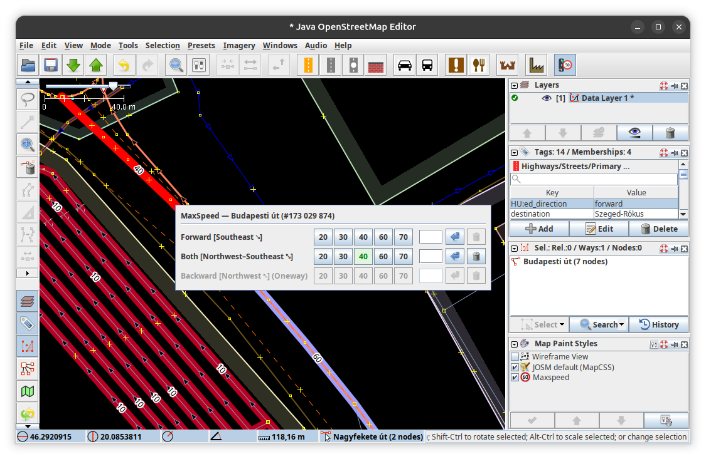

#  MaxSpeed Editor

MaxSpeed Editor is a small [JOSM](https://josm.openstreetmap.de/) plugin for quickly editing `maxspeed`, `maxspeed:forward` and `maxspeed:backward` on selected highways. It provides configurable speed presets, direction labels based on the clicked road segment, one-way-aware controls and atomic undo/redo operations.

Requires Java 21 or newer.



## Configurable presets
The plugin can be configured with the following JOSM preferences:
- `maxspeed-editor.presets`: defaults to
    - [20, 30, 40, 60, 70]
- `maxspeed-editor.highways` defaults to
    - [motorway, motorway_link, trunk, trunk_link, primary, primary_link, secondary, secondary_link, tertiary, tertiary_link, unclassified, residential, living_street, service, track, busway]

## Development

The plugin targets Java 21.

It intentionally uses the custom Gradle JOSM plugin checkout as a sibling directory; its location can be overridden with `-PjosmPluginPath=/path/to/gradle-josm-plugin`.

```shell
./gradlew test jar
```

The plugin JAR is placed in `build/libs`.